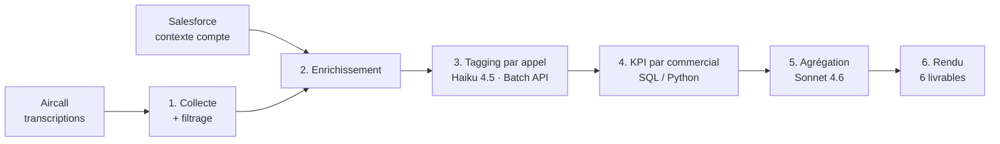

# Pipeline d'analyse des appels commerciaux

**Transformer plusieurs milliers de conversations téléphoniques en coaching individuel, sans jamais laisser un modèle inventer un chiffre.**

Système déployé dans le cadre de la [cartographie IA](..) d'une PME cosmétique française (distribution pharmacie B2B, e-commerce B2C). Le service commercial vend à 100 % par téléphone : la performance repose entièrement sur la qualité de milliers d'appels par mois, que personne ne peut écouter.

Volume traité : **~8 350 appels sur une fenêtre de trois semaines**, une quinzaine de commerciaux. Statut : **pilote validé, industrialisation en cours.**

---

## Le problème réel

Le besoin exprimé au départ était « analyser les appels avec l'IA ». Le besoin réel, découvert en atelier avec le responsable commercial, était différent : il ne manquait pas d'analyse, il manquait **un support de coaching qu'un manager puisse poser sur la table devant un commercial sans avoir à le vérifier ligne à ligne**.

Cette nuance a déterminé toute l'architecture. Un rapport dont 5 % des chiffres sont faux n'est pas un rapport à 95 % utile : c'est un rapport inutilisable, parce que le manager doit tout recontrôler. La contrainte de conception n'était donc pas la qualité moyenne, mais **l'absence totale de fabrication**.

---

## Architecture

Deux étages IA seulement, séparés par une frontière stricte :

- **Étage 1 — tagging unitaire.** Chaque appel décroché est transformé en JSON structuré de « moments » (accroche, point stock, objection et sa réponse, closing, next step…), chacun noté et accompagné d'un verbatim exact. Claude Haiku 4.5 via la Batch API, avec mise en cache du prompt système — identique pour les 8 350 appels.
- **Étage 2 — agrégation par commercial.** Claude Sonnet 4.6, qui travaille **uniquement sur les JSON de l'étage 1 et les KPI calculés**. Il ne relit jamais une transcription.

Les indicateurs chiffrés (taux de transformation, paniers, taux de joignabilité, taux d'exécution des priorités commerciales) sont calculés en SQL/Python. **Jamais par un modèle.**

---

## Décisions d'ingénierie

### 1. `script = facts / LLM = prose`

**Problème.** Un modèle à qui l'on demande une synthèse commerciale produit spontanément des chiffres plausibles et faux, et des citations client reconstituées de mémoire.

**Décision.** Séparation stricte de propriété : le code possède et injecte les chiffres, les noms, les verbatims et les identifiants de compte. Le modèle ne produit que du qualitatif — le diagnostic, la formulation, la hiérarchisation. Corollaire adopté ensuite : **diagnostic autorisé, prescription bridée** — le modèle décrit ce qui s'est passé, il n'invente pas de méthode de vente.

**Résultat.** Aucun chiffre d'un livrable ne peut être faux autrement que par une erreur SQL, qui est testable. C'est la règle qui a rendu le système diffusable.

### 2. L'étage 2 ne relit jamais les transcriptions

**Problème.** Faire relire les appels bruts au modèle d'agrégation aurait été plus simple à écrire, et laissait la porte ouverte à des interprétations divergentes entre les deux étages.

**Décision.** Frontière dure entre les étages. Le tagging est le seul point de contact avec le texte source ; tout le reste travaille sur des objets structurés.

**Résultat.** Coût maîtrisé (le contexte long n'est payé qu'une fois, en lot, sur le modèle le moins cher), reproductibilité, et surtout **une seule source de vérité à corriger** quand une définition métier évolue. Le corollaire s'est vérifié dans les deux sens : une définition erronée dans le prompt de tagging contamine silencieusement tous les livrables en aval.

### 3. Le gate de grounding — et sa régression

**Problème.** Les fiches de coaching contiennent une rubrique « à dire » : la formulation concrète à réutiliser. C'est la partie la plus utile pour un commercial, et celle où la tentation de fabriquer est maximale.

**Décision.** Toute assertion de cette rubrique porte obligatoirement une **source appartenant à une liste fermée** : un pair identifié, le commercial lui-même, un livrable transverse, la bibliothèque d'objections validée, ou un principe générique. Hors liste — ou placeholder non résolu — l'élément est rejeté à la génération.

**Ce qui s'est passé ensuite.** Un run a produit des fiches nettement plus lisibles : des scripts fluides, des objections bien reformulées. Elles étaient inventées de bout en bout — jusqu'à l'état de stock d'un client et des noms de références inexistants. Deux causes cumulées : le gate n'avait pas été exécuté, et le pipeline avait accepté de générer sur des données amont absentes.

**Correctif.** Le gate est redevenu bloquant, et deux garde-fous ont été ajoutés : **fail-fast sur les entrées** (refus de générer si un input amont est manquant, vide, ou porte une fenêtre temporelle différente de celle demandée) et **fenêtre unique en configuration centrale**, au lieu d'un paramètre passé indépendamment à chaque étape — trois fenêtres différentes avaient circulé sur un même run.

**Ce que j'en retiens.** Un système anti-hallucination n'est pas une propriété du prompt, c'est une propriété du pipeline. Et il se dégrade dans le sens agréable : la sortie inventée est toujours plus jolie que la sortie contrainte, ce qui rend la régression difficile à repérer à l'œil.

### 4. Détecter un axe de progression : seuil absolu **et** repère relatif

**Problème.** Classer un commercial « à améliorer » sur un critère où toute l'équipe est mauvaise n'apprend rien. L'inverse — ne comparer qu'à la moyenne — masque les faiblesses collectives.

**Décision.** Trois niveaux, avec deux références complémentaires : sous le **plancher absolu** défini par le métier, c'est un point faible quel que soit le reste de l'équipe ; au-dessus du plancher mais sous la **moyenne des pairs**, c'est un axe de progression ; au-dessus des deux, c'est acquis. Ordre de tri : gravité → position vs moyenne → poids business → écart. Seuils d'effectif minimum pour éviter de coacher sur du bruit statistique.

**Résultat.** Les fiches distinguent « tu es en retard sur ton équipe » de « l'équipe entière ne le fait pas », qui sont deux problèmes de management différents.

### 5. Comparer à qui ? Segmentation du portefeuille et leave-one-out

**Problème.** Comparer un commercial gérant de gros comptes à un commercial gérant de petits comptes produit un classement de portefeuilles, pas de compétences.

**Décision.** Les indicateurs sensibles à la qualité du portefeuille (transformation, closing, joignabilité) sont comparés à un **groupe de comptes équivalents**, en excluant le commercial évalué de sa propre moyenne de référence. Les indicateurs de comportement pur (exécution des priorités, qualité de l'accroche, verrouillage du prochain rendez-vous) restent comparés à l'équipe entière. Moyenne calculée **une voix par commercial**, jamais en agrégeant les appels — sinon les gros volumes écrasent le repère.

**Résultat.** Cette distinction, invisible dans une spécification écrite, est venue directement d'un atelier : le responsable commercial refusait un classement unique parce qu'il savait que les portefeuilles n'étaient pas comparables. Il avait raison, et le modèle statistique devait le refléter.

### 6. Le critère métier qui ne servait à rien

**Problème.** L'ordre de tri prévoyait un critère « poids business » par priorité commerciale. Les fiches produites donnaient des résultats étranges : une priorité à fort enjeu de chiffre d'affaires n'apparaissait presque jamais, tandis qu'un critère marginal occupait deux emplacements sur quatre dans la moitié des fiches.

**Diagnostic.** Les poids étaient restés à leur valeur par défaut, identique partout. Le critère était un **no-op silencieux** : tous les éléments à égalité, le tri retombait sur l'écart brut — ce qui sur-représente mécaniquement les critères à faible dénominateur.

**Décision.** Retour au métier : planchers et poids fixés priorité par priorité par le responsable commercial, en réunion, et versionnés en configuration. Puis validation « à sec » de la sélection d'axes des quinze fiches **avant** tout rendu, pour vérifier le tri sans dépendre d'une relecture de PDF.

**Ce que j'en retiens.** Un paramètre métier laissé à sa valeur par défaut ne produit pas une erreur, il produit une opinion — celle du développeur, appliquée à l'insu de tout le monde. C'est le type de défaut qui ne remonte jamais par un test unitaire.

### 7. Quand le système révèle un problème que le code ne peut pas résoudre

Le livrable de coaching devait proposer, sur chaque axe faible, **l'exemple d'un collègue comparable qui réussit sur ce même point** — pas une bonne pratique théorique, mais une phrase réellement prononcée en interne.

Mesure sur l'ensemble du pilote : sur 31 axes coachés, **2 disposaient d'un exemple interne valable**. Ventilation des 29 restants : dans 16 cas, **aucun pair du groupe comparable n'exécutait ce réflexe** ; dans 13 cas, un exemple existait mais était déjà utilisé ailleurs dans la même fiche. Les critères de qualité et de lisibilité, eux, n'écartaient rien.

La tentation évidente était d'élargir les critères jusqu'à ce que la rubrique se remplisse — croiser hors groupe comparable, accepter un exemple portant sur un autre sujet. Un run l'a fait spontanément : le résultat était présentable et faux, un commercial junior se voyant recommander l'exemple d'un senior sur un sujet qui n'était pas son axe faible.

**La bonne lecture était l'inverse : les 16 cas vides n'étaient pas un défaut du système, ils étaient son premier résultat.** Ils mesuraient une compétence absente de l'équipe entière — exactement ce que le responsable commercial soupçonnait sans pouvoir le prouver. La réponse n'est pas du code : c'est une session de travail avec lui pour constituer une bibliothèque de réponses validées, qui alimentera la source manquante.

---

## Ce que le terrain a appris

- **Le goulot d'étranglement est la donnée, jamais le modèle.** Les trois défauts les plus coûteux du projet — une définition métier erronée dans le prompt de tagging, des paramètres restés à leur valeur par défaut, des fenêtres temporelles divergentes entre étapes — n'avaient aucun rapport avec la qualité du modèle. Aucun n'aurait été corrigé en changeant de fournisseur.
- **Une contrainte métier explicite vaut mieux qu'un modèle plus intelligent.** L'interdiction de prescrire un ordre ou un timing dans les objectifs (« dans les trente premières secondes… ») vient d'un refus net du responsable commercial : ses commerciaux n'appliquent pas de script minuté, et une consigne de ce type décrédibilise la fiche entière. Cette règle est devenue un contrôle automatique sur tous les champs générés.
- **La régression se produit dans le sens agréable.** Chaque dérive observée rendait la sortie plus lisible et plus fluide. Sans contrôle automatisé et sans relecture adverse, elle passait.
- **Un livrable diffusable a un coût de dernier kilomètre disproportionné.** L'analyse fonctionnait bien avant que les fiches soient présentables. Troncatures d'en-têtes, verbatims coupés en plein mot, libellés de comparaison erronés : rien d'intellectuellement difficile, et pourtant c'est ce qui séparait un prototype d'un document qu'un manager pose sur la table.

---

## État actuel

Pilote validé sur une quinzaine de commerciaux et une fenêtre de trois semaines. Le cœur — collecte, mise en contexte, tagging, calcul des indicateurs, génération — est fonctionnel et vérifié sur cas réels.

En cours : correction des définitions métier en amont du tagging avant tout traitement de volume, constitution de la bibliothèque de réponses validées, puis passage à l'échelle sur l'ensemble du volume d'appels.

## Stack

- **Traitement** — Python, MySQL, SQL analytique
- **Sources** — Aircall (transcriptions), Salesforce (contexte compte, historique, segmentation)
- **IA** — Claude Haiku 4.5 sur l'étage unitaire (Batch API + prompt caching), Claude Sonnet 4.6 sur l'agrégation ; dimensionnement du modèle par tâche, pas par réflexe ; journalisation de chaque appel modèle pour le suivi de coût par cas d'usage ; architecture pensée pour basculer de fournisseur sans réécriture
- **Développement** — Claude Code, avec spécifications versionnées et checklist de conformité rejouable à chaque itération

---

*Les livrables, les identifiants de compte, les noms et les indicateurs de cette page ont été retirés ou généralisés. Les décisions d'architecture et les enseignements sont rapportés tels quels. Versions de modèles indiquées à la date du pilote (été 2026).*
